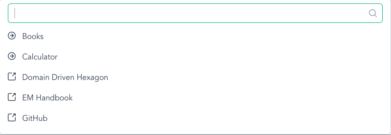

# Handy

Simple application to replace Spotlight.

Current status: proof of concept.

## Supported features

- Global shortcut with Ctrl+Space
- Open links in default browser
- Run programs



## Dependencies
- Node.js
- Rust

## How to run

```bash
make ci
make dev
```

## How to build

```bash
make build
```
